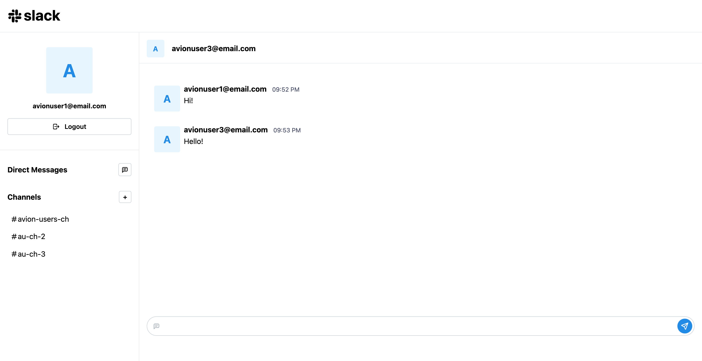
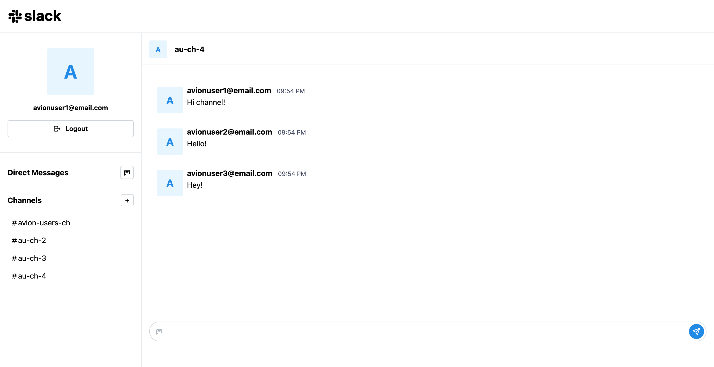

# slack-app

This project is a replica of the Slack application.

## Tech Stack

- HTML
- SCSS
- React

## Features

- Sign in and register an account
- Create channels
- Add users to channels
- Send a message to channels
- Send a message to users

## Test Accounts

- `email: avionuser1@email.com`  
  `password: 12345678`

- `email: avionuser2@email.com`  
  `password: 12345678`

- `email: avionuser3@email.com`  
  `password: 12345678`

### Live Demo: https://slack-app-xi.vercel.app/

Note: Disable secure connection due to API limitation
1. Site settings
2. Insecure content > Allow
